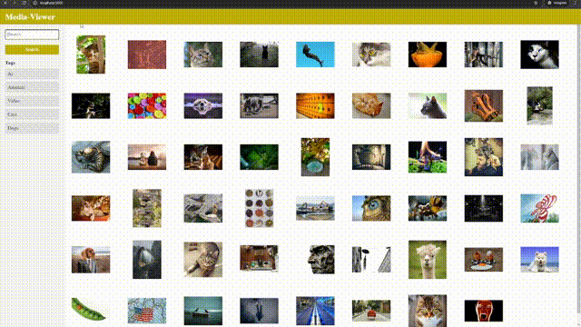

# Media-Viewer 

**Media-Viewer** is a program for managing videos and images in various formats. The goal of this project was to achieve the targeted functionality as quickly as possible, which influenced the decision to use AI for generating the frontend. The program provides a simple way to organize media files locally without relying on complex folder structures. It includes a fast, tag-based search engine, allowing users to quickly locate files even in large collections. Media-Viewer runs a local server using Spring Boot, enabling file management and browsing through a web interface. 

## Features 
- View media files
- Navigation between files with arrow keys
- Video rewind with hotkeys
- Zoom in and out; picture dragging
- Adding tags and search by tags
  
## Motivation 
After years of saving images and videos, I wanted a way to organize my files efficiently without relying on online services. Traditional picture viewers made it difficult to handle different formats and maintain an overview of my collection. Media-Viewer was built to solve these issues by offering an offline, tag-based solution that provides the benefits of modern media hosting platforms. 

## Technologies
- Thymeleaf
- SpringBoot
- MySQL
- JDBC
  
## Functionality Demo

